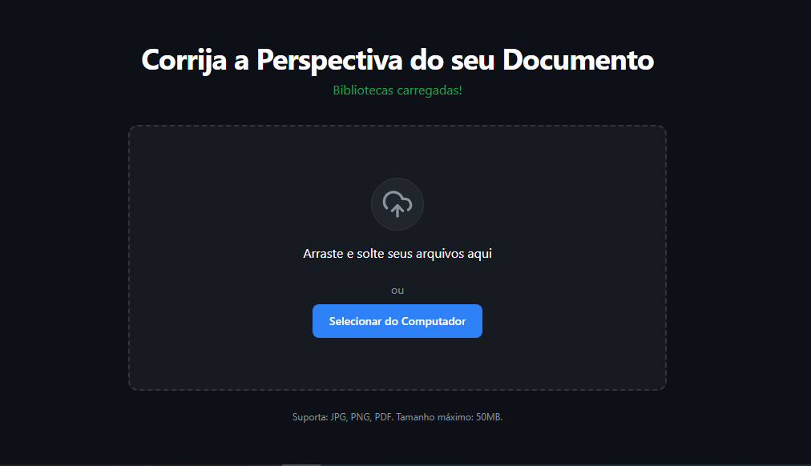
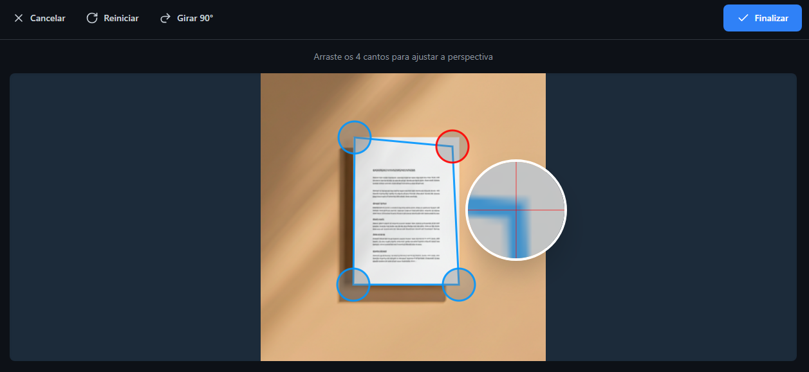

# VoxScan - Ferramenta de Correção de Perspectiva de Documentos

**Criado com [GenAI Apps](https://aistudio.google.com/app-brazil) e design inspirado no [Google Stitch](https://stitch.google.com).**

VoxScan é uma poderosa aplicação web progressiva (PWA) projetada para corrigir a perspectiva de imagens e documentos PDF. Se você já tirou uma foto de um documento em um ângulo, o VoxScan permite que você "aplane" a imagem, como se ela tivesse sido escaneada perfeitamente. A aplicação funciona inteiramente no seu navegador, garantindo que seus arquivos permaneçam privados e seguros.



---

## ✨ Principais Funcionalidades

- **Correção de Perspectiva Precisa**: Arraste os quatro cantos do seu documento para ajustar e corrigir a perspectiva com precisão.
- **Detecção Automática de Cantos**: A aplicação utiliza OpenCV.js para tentar encontrar automaticamente os cantos do documento, acelerando o fluxo de trabalho.
- **Lupa de Precisão**: Ao arrastar um canto, uma lupa de zoom aparece para garantir um posicionamento perfeito do pixel.
- **Suporte a Múltiplos Formatos**: Carregue arquivos **JPG**, **PNG** e **PDF**.
- **Processamento em Lote**:
  - Edite individualmente cada página de um **PDF de múltiplas páginas**.
  - Carregue **múltiplas imagens** de uma só vez para processamento em lote.
- **Organizador Visual**: Reordene páginas ou imagens arrastando e soltando, gire ou exclua itens antes de finalizar.
- **Filtros de Pós-Processamento**:
  - **Filtro Mágico**: Limpa o fundo e melhora o contraste do texto com um clique.
  - **Preto e Branco**: Converte a imagem para um modo de documento de alto contraste.
  - **Ajustes Manuais**: Controle a intensidade do contraste e da nitidez.
- **Limpeza Avançada**: Uma ferramenta de pincel para "apagar" sombras, manchas ou outros artefatos indesejados da imagem.
- **Zoom e Panorâmica**: Inspecione a imagem corrigida em detalhes com controles intuitivos de zoom e panorâmica.
- **Múltiplas Opções de Exportação**:
  - Salve o resultado como uma imagem **PNG**.
  - Salve o resultado como um documento **PDF**.
  - Baixe um lote de imagens processadas como um arquivo **ZIP**.
  - Compile um PDF editado ou um lote de imagens em um único **PDF final**.
- **Totalmente Offline**: Graças a um Service Worker, o VoxScan pode ser carregado e usado mesmo sem uma conexão com a internet após a primeira visita.
- **Responsivo e Moderno**: Uma interface limpa e intuitiva que funciona perfeitamente em desktops e dispositivos móveis.

---

## 🚀 Como Usar

O fluxo de trabalho é dividido em etapas simples e claras.

### Etapa 1: Upload

A interface inicial é limpa e direta. Você pode arrastar e soltar seus arquivos diretamente na área indicada ou clicar no botão para selecionar os arquivos do seu computador.

1.  Acesse a página inicial.
2.  **Arraste e solte** seu arquivo (ou arquivos) na área designada.
3.  Ou, clique em **"Selecionar do Computador"** para abrir o seletor de arquivos.

Você pode carregar uma única imagem (JPG, PNG), um único PDF ou múltiplas imagens ao mesmo tempo.


### Etapa 2: Pré-visualização e Edição

#### Para um Único Arquivo
Ao carregar um único arquivo, você é levado diretamente para a tela de edição. Aqui, você ajusta os quatro marcadores para delinear a área exata do documento. A lupa de precisão ajuda a posicionar os cantos perfeitamente.

1.  **Ajuste os Cantos**: Arraste os quatro marcadores.
2.  **Girar**: Use o botão "Girar 90°" se necessário.
3.  **Reiniciar**: Volte aos cantos detectados automaticamente.
4.  Clique em **"Finalizar"** quando estiver satisfeito.



#### Para um PDF ou Lote de Imagens
Se carregar um PDF com várias páginas ou um lote de imagens, você verá a tela de pré-visualização. Ela exibe miniaturas de todos os itens, permitindo que você os organize antes da edição final.

1.  **Reordenar**: Arraste as miniaturas para mudar a ordem.
2.  **Girar/Excluir**: Use os botões de ação rápida em cada miniatura.
3.  **Editar um Item**: Clique em uma miniatura para abri-la na tela de edição. Itens já editados são marcados com um ✔️.
4.  Quando terminar, clique em **"Baixar como ZIP"** (para imagens) ou **"Finalizar e Baixar PDF"**.


### Etapa 3: Resultado e Exportação

Esta é a etapa final, onde você pode refinar e exportar seu documento corrigido. Inspecione o resultado com zoom, aplique filtros para melhorar a legibilidade e use a ferramenta de limpeza para remover imperfeições.

1.  **Inspecionar**: Use o scroll do mouse para **zoom** e clique e arraste para **panorâmica**.
2.  **Aplicar Filtros**: Teste o "Filtro Mágico" ou ajuste manualmente o contraste e a nitidez.
3.  **Limpeza Avançada**: "Pinte" sobre sombras ou manchas para removê-las.
4.  **Exportar**: Dê um nome ao arquivo, escolha o formato (PNG ou PDF) e clique em **"Confirmar e Baixar"**.


---

## 🛠️ Stack Tecnológico

A aplicação é construída com tecnologias web padrão, focando na performance e no processamento do lado do cliente.

-   **Frontend**: HTML5, CSS3, JavaScript (ES6+)
-   **Estilização**: [Tailwind CSS](https://tailwindcss.com/) para uma prototipagem rápida e um design consistente.
-   **Processamento de Imagem**: [OpenCV.js](https://docs.opencv.org/4.9.0/opencv.js.html), uma poderosa biblioteca de visão computacional compilada para WebAssembly. É o coração da detecção de cantos, correção de perspectiva e filtros.
-   **Manuseio de PDF**:
    -   [PDF.js](https://mozilla.github.io/pdf.js/): Usado para renderizar as páginas de arquivos PDF em elementos canvas.
    -   [jsPDF](https://github.com/parallax/jsPDF): Usado para criar os arquivos PDF de saída.
-   **Arquivos ZIP**: [JSZip](https://stuk.github.io/jszip/) para criar arquivos `.zip` no navegador ao exportar lotes de imagens.
-   **Ícones**: [Lucide Icons](https://lucide.dev/), uma biblioteca de ícones bonita e consistente.
-   **Funcionalidade Offline**: [Service Workers API](https://developer.mozilla.org/en-US/docs/Web/API/Service_Worker_API) para cachear os assets da aplicação e permitir o uso offline.

---

## 📂 Estrutura do Projeto

```
/
├── assets/
│   ├── favicon.png
│   ├── screenshot-geral.png
│   ├── screenshot-upload.png
│   ├── screenshot-edicao.png
│   ├── screenshot-preview.png
│   └── screenshot-resultado.png
├── js/
│   └── script.js       # Lógica principal da aplicação
├── style/
│   └── style.css       # Estilos personalizados e configuração do Tailwind
├── index.html          # Estrutura principal da página
├── manifest.json       # Configuração do Web App Manifest (PWA)
├── README.md           # Este arquivo
└── sw.js               # Lógica do Service Worker para cache offline
```
